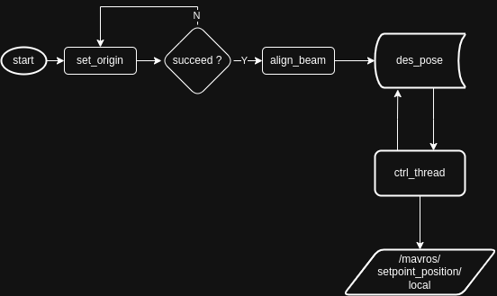

# Dependencies
```bash
sudo apt update
sudo apt install libeigen3-dev libspdlog-dev libgeographic-dev
```

# Flow


# Usage
```bash
# 首先调用set_origin服务设置基站位置
rosservice call /bs_ctrl/set_origin [lat] [lon] [alt]
# 随后调用align_beam服务控制飞机对准目标位置， 同时该服务会返回d_yaw, d_pitch两个角度
rosservice call /bs_ctrl/align_beam [lat] [lon] [alt]
```